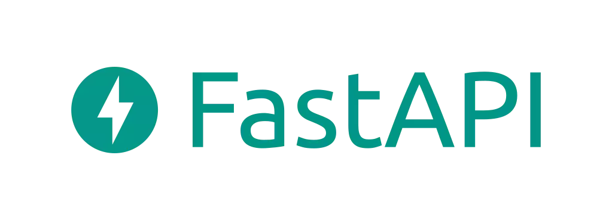

# FastAPI Basic Code | One Numan

This repository contains basic code snippets and examples for getting started with FastAPI, a modern, fast (high-performance), web framework for building APIs with Python 3.7+ .



## Features

- Basic setup of FastAPI application
- Example of defining API endpoints
  - Static | Home Route `http://127.0.0.1:8000/`
  - Dyanmic | Book ID | `http://127.0.0.1:8000/book/1`
  - Fast API | Documentation `http://127.0.0.1:8000/docs`

## Getting Started

### Prerequisites

- Python 3.7 or above
- pip (Python package installer)

### Installation

1. Clone the repository:

   ```bash
   git clone https://github.com/one-numan/Fast_API_basic_code.git
   cd Fast_API_basic_code
   ```

2. Create Virtual Enviroment
   ```bash
   python -m venv venv
   ```
3. Activate venv
   Windows Users `venv\Scripts\activate`

4. Installing Required Modules
   ```bash
   pip install -r requirements.txt
   ```
5. Run Code

   ```bash
   python app.py

   ```
